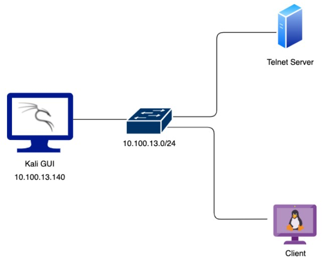
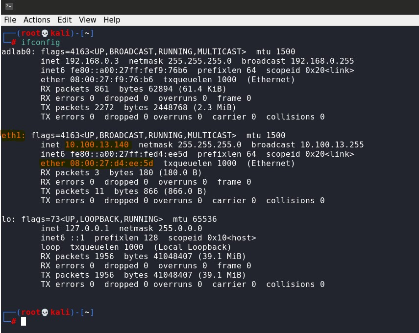
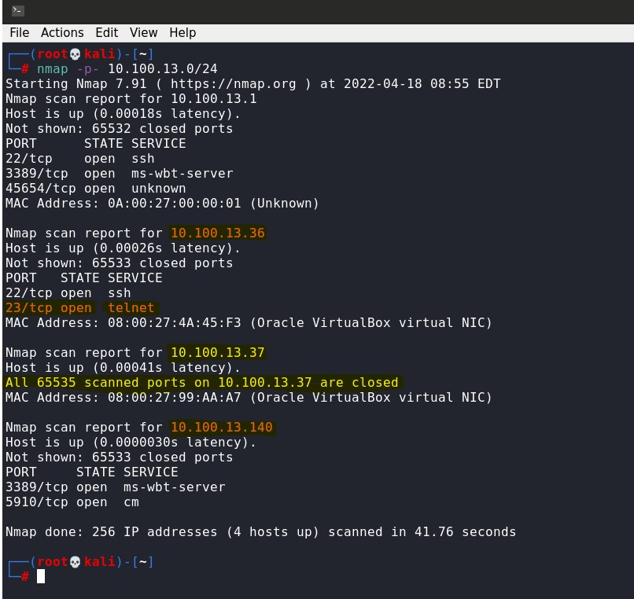
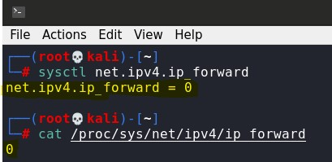
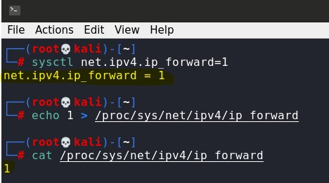
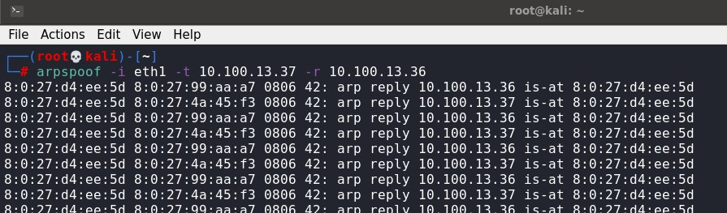
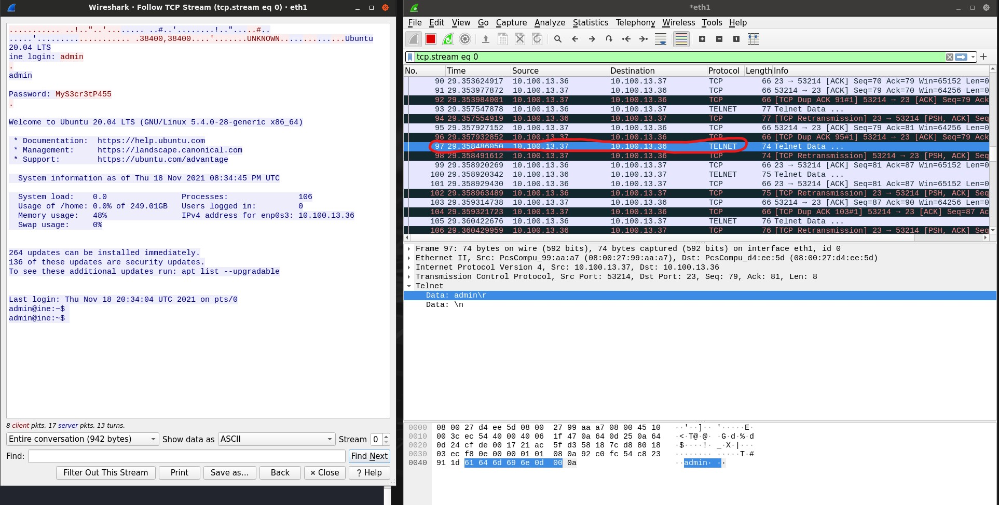
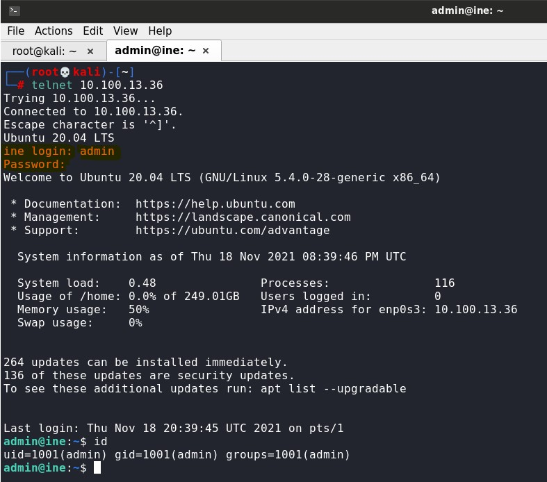

# ARP Poisoning -lab

## Objective

There is a telnet server and a client machine on the same network and the client machine authenticates with the telnet server, every 30 seconds. 

Identify the telnet server and client machine, steal the telnet login credentials by performing an ARP poisoning attack, and log in to the server.

## Target info

* Network: 10.100.13.0/24

  * Gateway: 10.100.13.1
  * Telnet-server: 10.100.13.36
  * Client: 10.100.13.37
  * User machine: 10.100.13.140

## 1. Scan the network and identify the machines

Check the interfaces available for your machine:

    ifconfig

Run a port scan on the network. The scan finds 4 hosts: 

* 10.100.13.1 (Network Gateway)
* 10.100.13.36 (Telnet server)
* 10.100.13.37 (Client)
* 10.100.13.140 (User machine)

## 2. Set up IP-forwarding and ARP spoofing

To be able to use your Linux machine as a router and forward packets that are meant for other destinations, IP forwarding needs to be enabled. Current status of IP forwarding can be checked with the command:

    sysctl net.ipv4.ip_forward

Or by viewing the content of the file /proc/sys/net/ipv4/ip_forward:

    cat /proc/sys/net/ipv4/ip_forward

IP forwarding can be enabled with the command:

    sysctl -w net.ipv4.ip_forward=1

Or by writing 1 to the file /proc/sys/net/ipv4/ip_forward

    echo 1 > /proc/sys/net/ipv4/ip_forward

To run an ARP poisoning attack, we need to send unsolicited ARP responses to the target to have it send data to our machine instead of the real destination. 

This can be done by running arpspoof to capture traffic in the switched network using addresses discovered earlier. We are trying to steal credentials to the telnet server, so the target should be set to the client (10.100.13.37) and the host to the telnet server (10.100.13.36). As the interface, we use eth1:

    arpspoof -i eth1 -t 10.100.13.37 -r 10.100.13.36

## 3. Monitor the telnet traffic and find the credentials

Now the traffic can be monitored with wireshark. Following a telnet connection from the client to the telnet server we can see the clear-text credentials: 

> admin MyS3cr3tP455

To verify the credentials we can login to the telnet server:

    telnet 10.100.13.36

