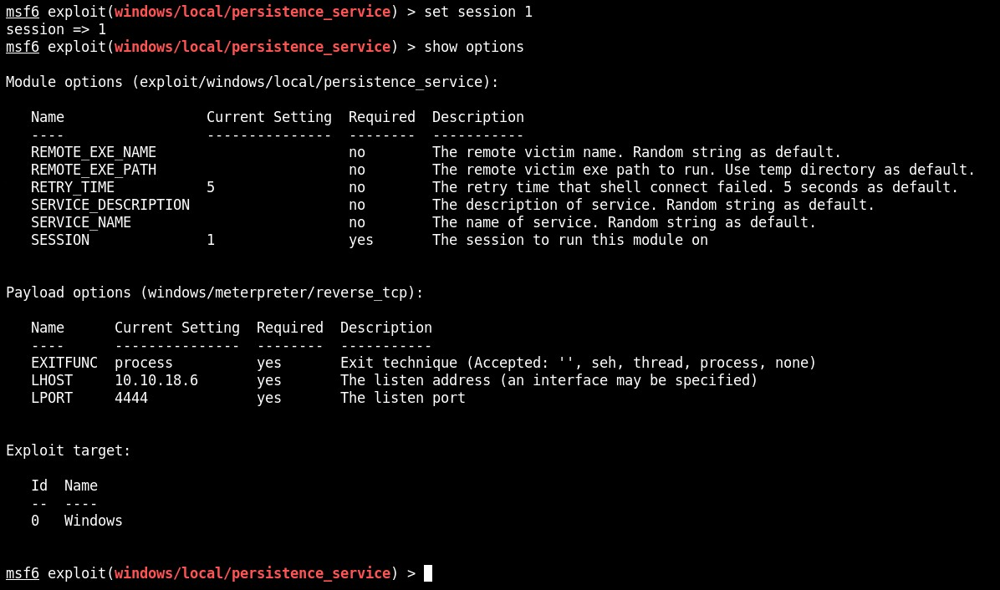

# Metasploit

## Objective

A vulnerable application can be accessed using the tools installed on Kali on http://demo.ine.local. 

1. Identify available services on the target

    * 80 - HTTP - HttpFileServer 2.3
    * 135 - RPC
    * 139 - NetBIOS
    * 445 - SMB
    * 3389 - RDP

2. Find vulnerability of the target application

3. Exploit the target using Metasploit Framework

4. Obtain SYSTEM privileges on the machine

5. Install Persistence backdoor

6. Extract AutoLogin credentials

## Target info

* Host: demo.ine.local - 10.2.17.143 (10.2.25.141 after lab crash and restart)

## 1. Identify available services on the target

Check that the host is live and get the IP:

Run a port scan with nmap:

Find more information about the HTTP service with:

    nmap -A -O -p 80 10.2.17.143

We find out the HttpFileServer is run with HFS 2.3. 

## 2. Find vulnerability of the target application

The exploit exploit/windows/http/rejetto_hfs_exec can be found for HFS:

## 3. Exploit the target using Metasploit Framework

Use the exploit/windows/http/rejetto_hfs_exec using the default payload, set the RHOSTS option to the target and check the LHOST ip-address. The exploit can then be run, giving us a meterpreter shell:

(At this point the lab crashed and needed to be restarted, IP address of target changed to 10.2.25.141)

## 4. Obtain SYSTEM privileges on the machine

Once we have a meterpreter shell, check the system info and the user priviledges we obtain:

    sysinfo

    getuid

We can see, that the server is running on Windows Server 2016 and we have Administrator priviledges. 

We can use the meterpreter script getsystem to escalate our priviledges to local system:

## 5. Install Persistence backdoor

(Restart of lab, IP address changed to 10.2.17.228)

Now that we have a meterpreter session on the system we can find a persistence backdoor. First, we background the current meterpreter session and find a persistence exploit:

    background
    search persistence

We will use the persistence_service, since service based backdoors are very stable.

Next, we check the options and see that the exploit needs to be set to active session. So we set it to session one, which is the previously obtained meterpreter shell:

When we run the exploit, we get another meterpreter shell:

Now, lets check if the backdoor works. First we need to kill all the existing sessions to the target:

    background
    sessions -K

Next we find and use the multi handler exploit to use as the listener and set the options (IP, port and payload) to match the backdoor:

Now, when we run exploit we get a meterpreter shell, so the backdoor works!

