# Null session -lab

## Objective

Scan the target machine and find the 3 flags:

1. Flag 1 is present in the file named flag_1 in a publicly accessible share.
> Answer: HgQQZGOH0twJLImZ1uWMHvRxETuw8kIC
2. Flag 2 is present in a directory named flag_2 in a non-browsable share of one of the users.
> Answer: jtiz1hI467CrRgPDeuDo4u1fCAdMsQFs
3. Flag 3 is present in a file named flag_3 in yet another non-browsable share.
> Answer: YrcxI1WVRN9gmIO4jJINdjSfOMf5SKsG

## Target info

* Host demo.ine.local - 192.129.36.3
* OS: Linux 4.15 - 5.6
* Open ports:
  
  * 139 - netbios-ssn - Samba smbd 4.6.2 
  * 445 - netbios-ssn - Samba smbd 4.6.2

* SMB domain: EVILCORP-SMB-SHARES
* Available shares:

  * public
  * ecorp
  * william
  * elliot
  * admin
  * share$
  * IPC$

* Users:

  * ecorp
  * william
  * raymond
  * michael
  * elliot
  * admin

Check that the host is alive and get the IP:

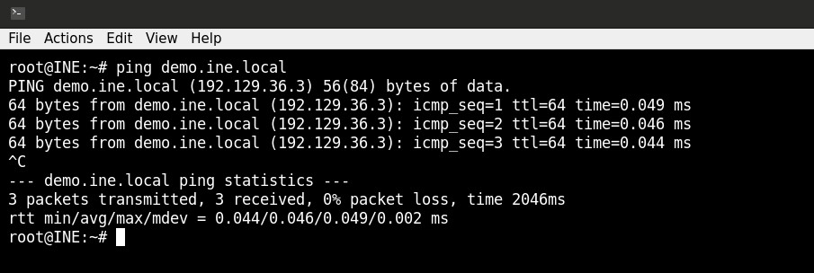

Run a port scan with version and OS-detection:

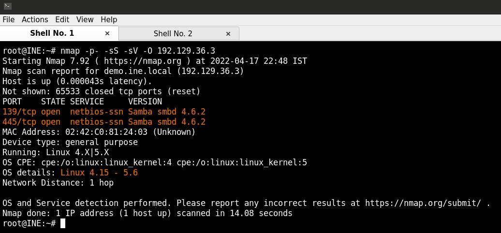

## 1. Flag 1

Run an nmblookup with enum4linux. The result shows the <20> flag meaning the File Server Service is open, and the user has open shares:

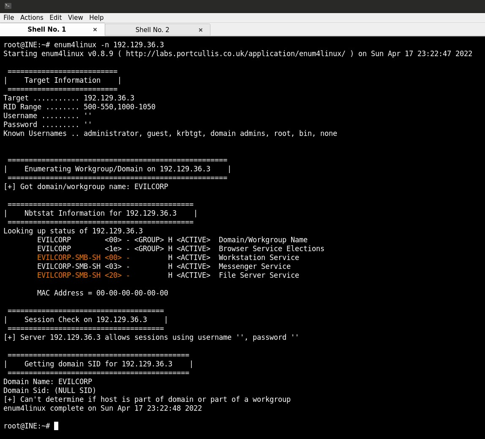

Next, we enumerate the password policies of the system using enum4linux:

    enum4linux -P 192.129.36.3

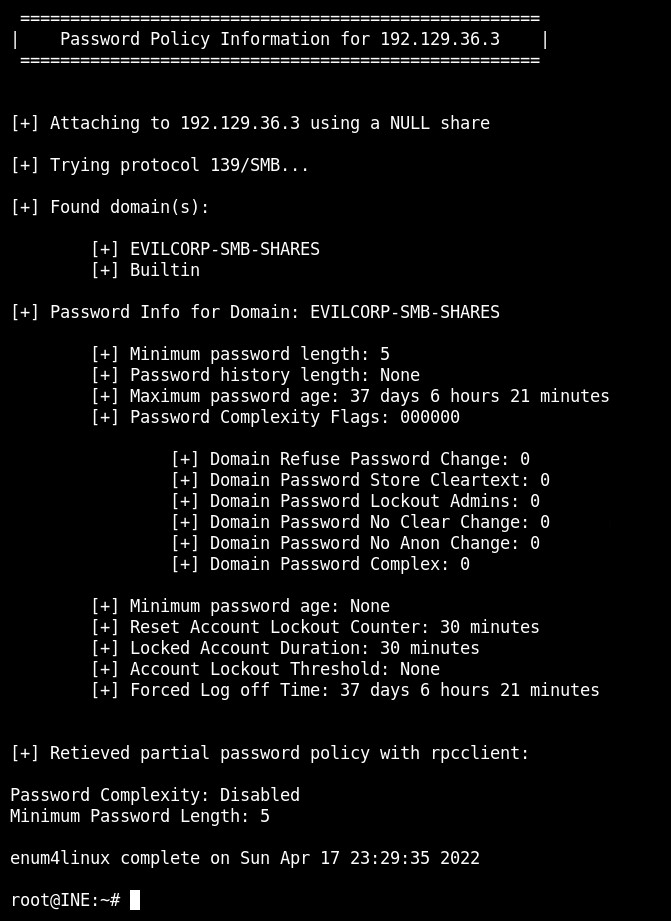

Enumerate browsable shares. From the output we can see that only the public share could be mapped:

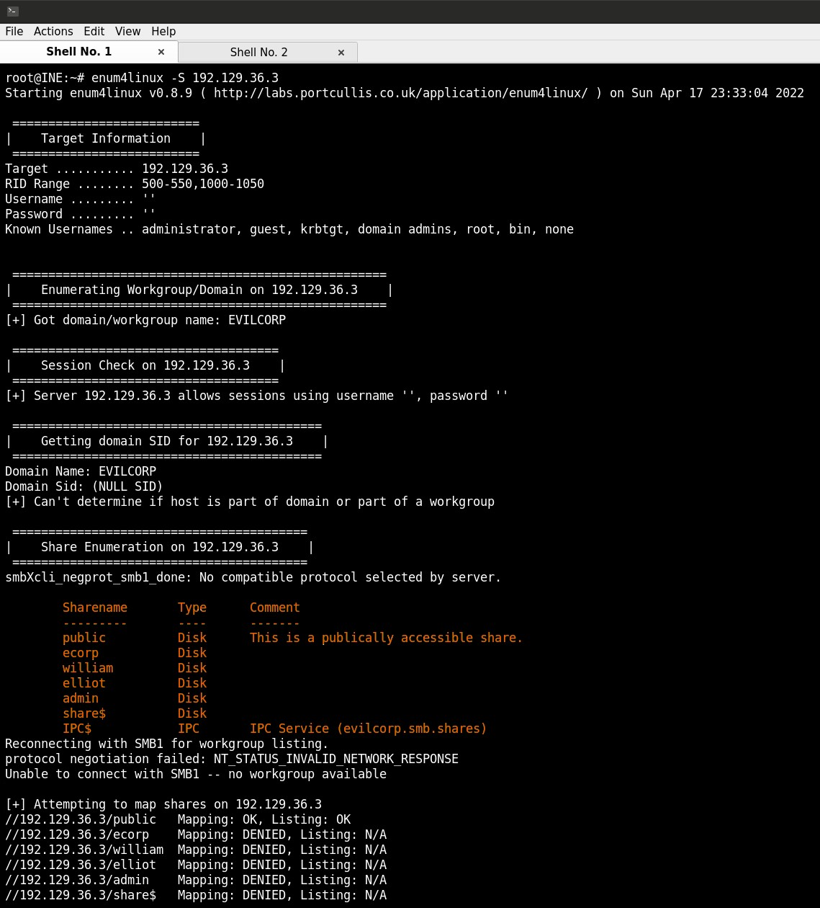

Get the users:

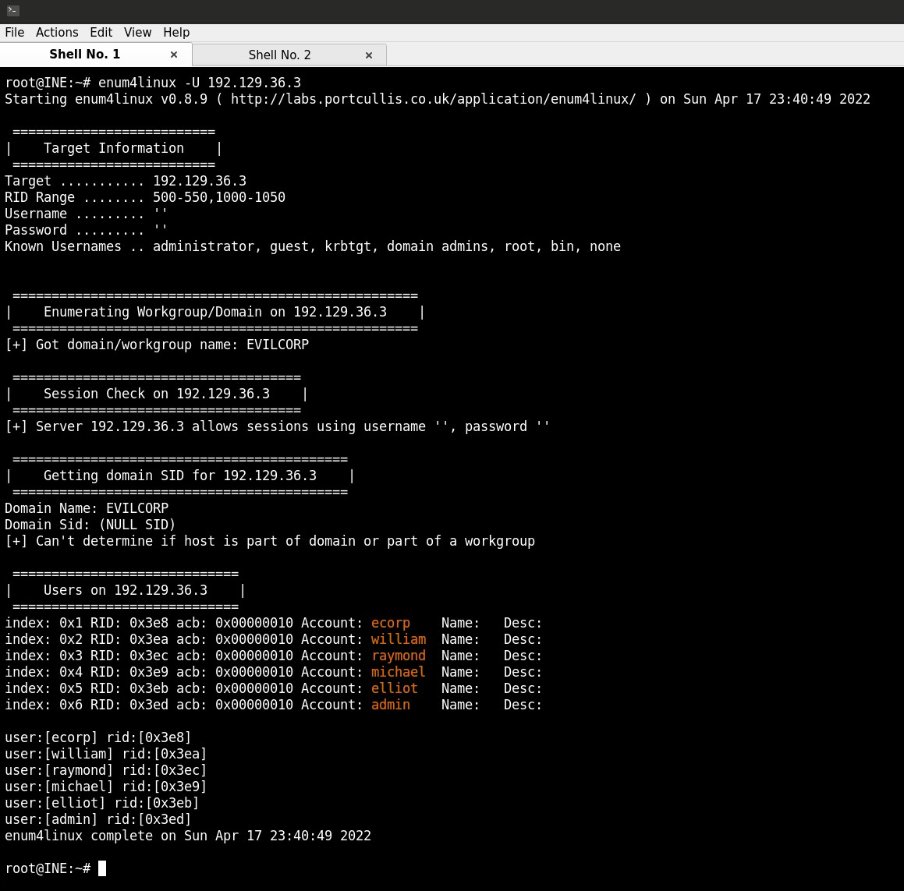

We can connect to the 'public' share using smbclient, find the flag and download it: HgQQZGOH0twJLImZ1uWMHvRxETuw8kIC

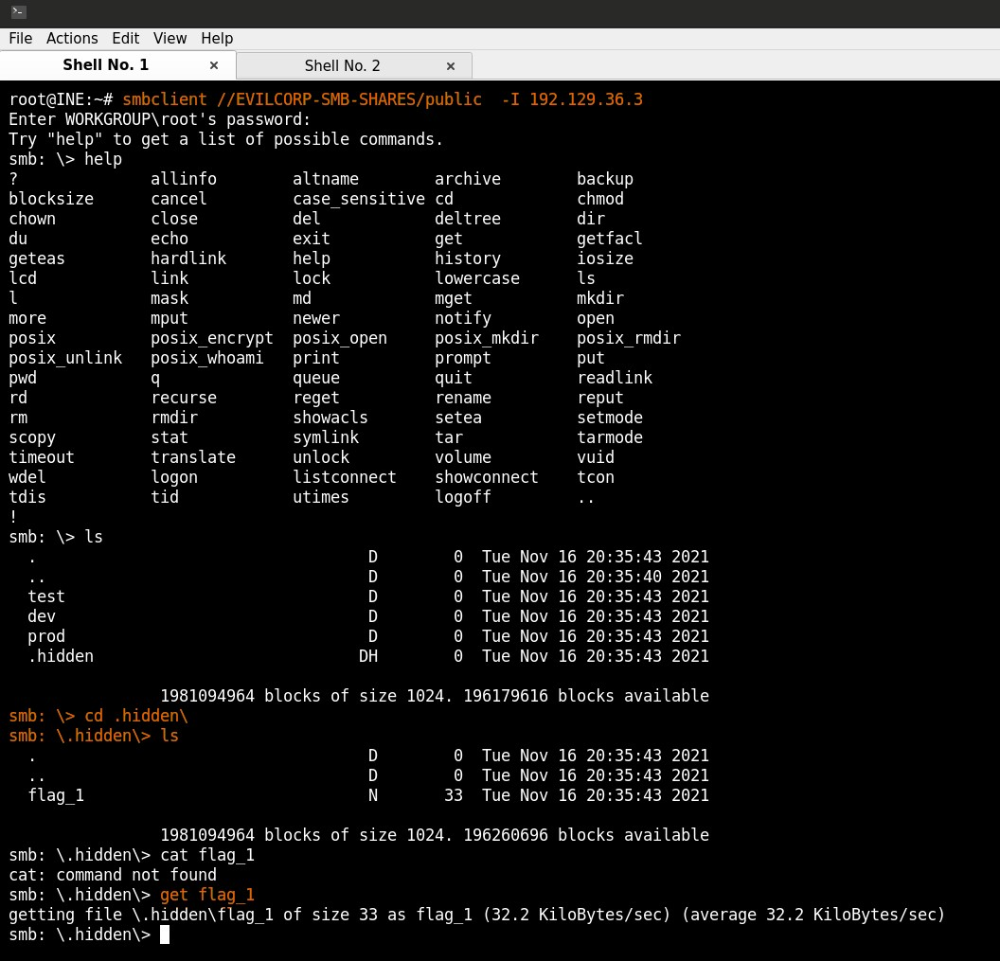

## 2. Flag 2

Trying to connect to the shares of users, whose name was not in the browsable shares list (michael and raymond) without password. Raymonds share can not be accessed but michaels can and so we can search for and display the flag: jtiz1hI467CrRgPDeuDo4u1fCAdMsQFs

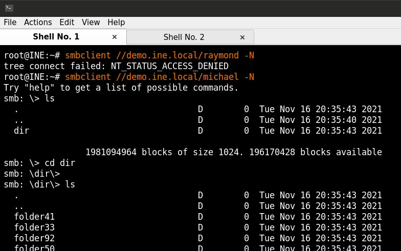

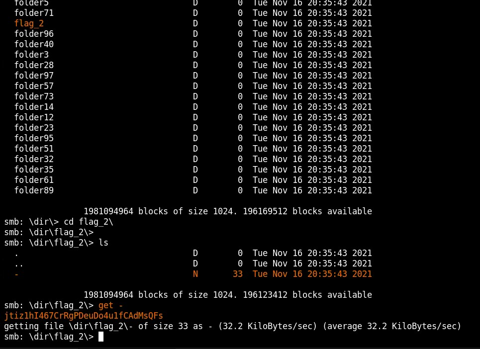

## 3. Flag 3

We can brute force search for more share names and we find a share named shadow1 that allows access without credentials:

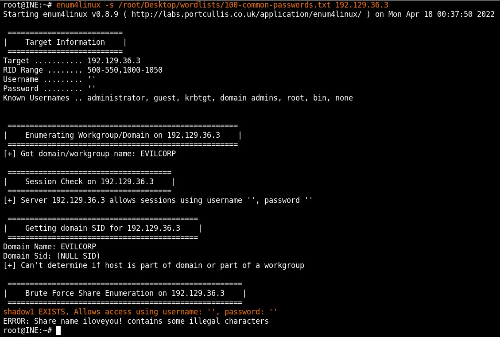

We can then access the share with smbclient and find the flag: YrcxI1WVRN9gmIO4jJINdjSfOMf5SKsG

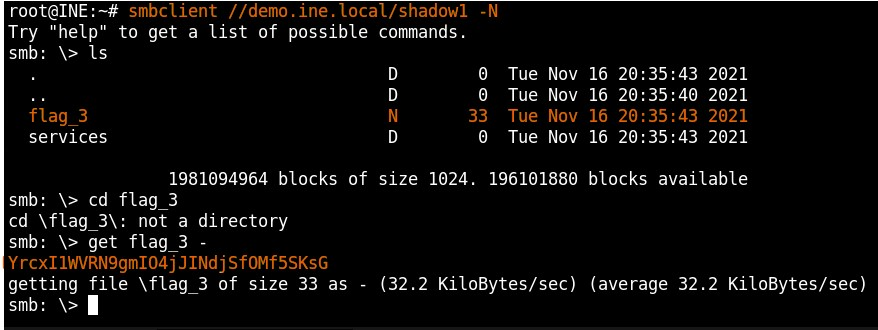
