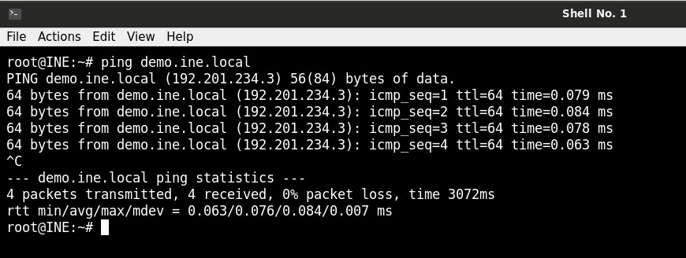
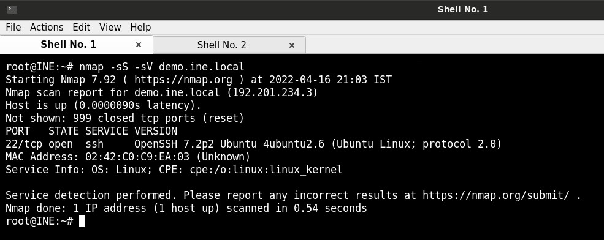
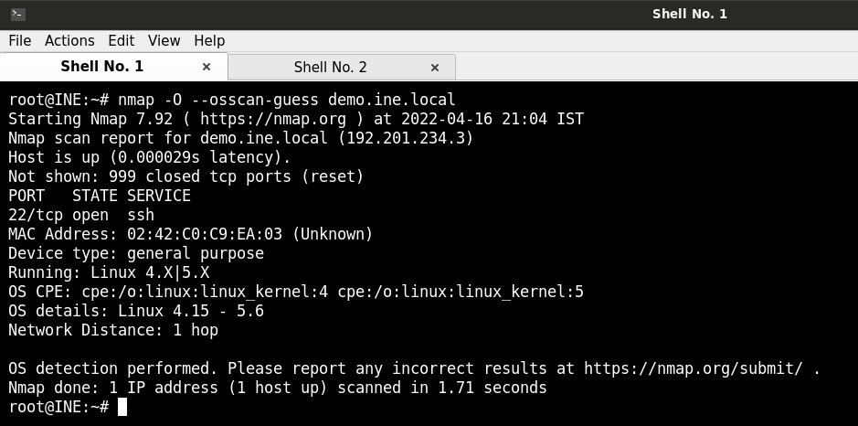
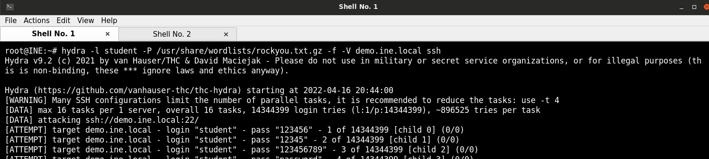
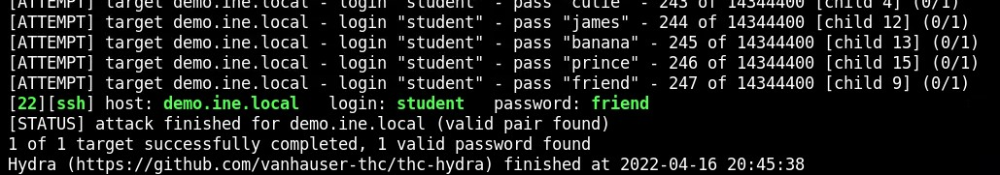
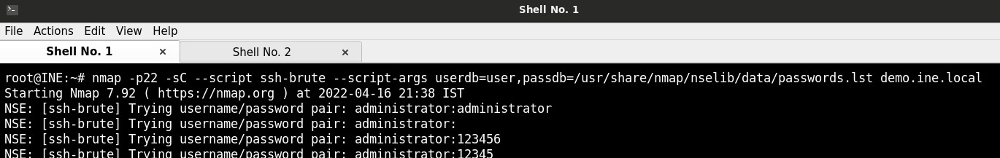
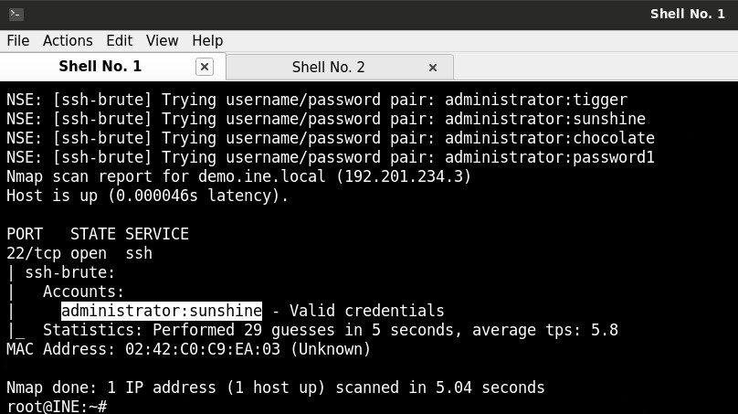
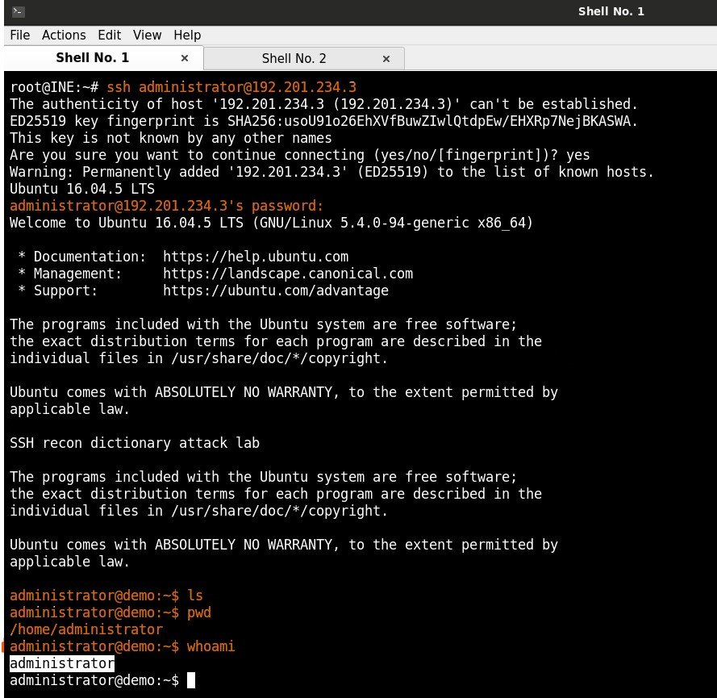

# Bruteforce and Password cracking Live -lab

## Objectives:
1. Find the password of user "student" using Hydra. Use password dictionary: /usr/share/wordlists/rockyou.txt.gz
> Answer: friend
2. Find the password of user "administrator" use appropriate Nmap script. Use password dictionary: /usr/share/nmap/nselib/data/passwords.lst
> Answer: sunshine
3. Find the password of user "root" using the ssh_login Metasploit module. Use userpass dictionary: /usr/share/wordlists/metasploit/root_userpass.txt
> Answer: 

## Recommended tools: 
* Metasploit Framework
* Hydra
* Nmap

## Target:

* Hostname: http://demo.ine.local (192.201.234.3)
* Service: ssh - OpenSSH 7.2
* OS: Ubuntu 4.15 - 5.6

## Solution:

Check that the target is alive:
    

Run a port scan with version detection

Run OS detection scan:

## 1. Find the password of user "student" using Hydra:

Run hydra with the following options:

* -l: Specify the username to use
* -P: Specify the wordlist to use for passwords
* -f: Stop trying after the first valid password is found
* -V: Verbose - display all attempts

Password 'friend' is found for username 'student'. 

## 2. Find the password of user "administrator" use appropriate Nmap script:

Since the target is an ssh server, the script to use is ssh-brute. The username "administrator" is added to a file called user and the following command is run to brute force the password:

The password for administrator is found to be sunshine:

Check the password by logging in to the service with administrator:sunshine:

