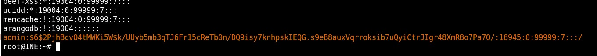
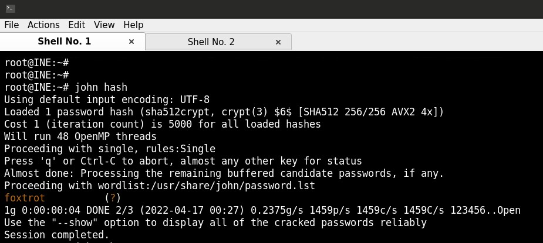
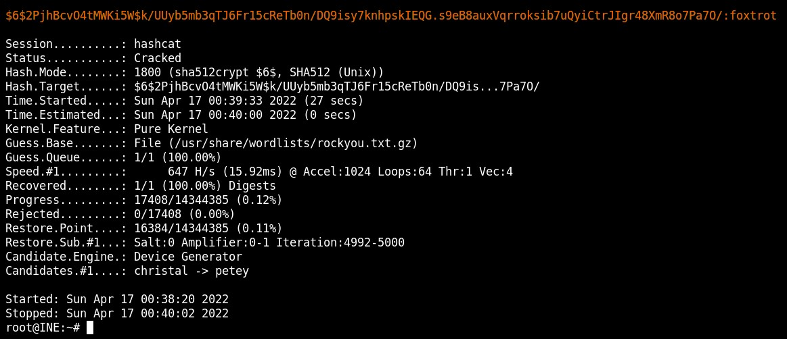

# Bruteforce and password cracking, offline

## Objectives:

1. Crack the hashes of user "admin" using John The Ripper/Hashcat and recover the password.
> Answer: foxtrot
2. Find the password for the protected Microsoft Office .docx file using John The Ripper/Hashcat.

## 1. Crack the hash of user "admin".

On Linux, the password hashes are stored in /etc/shadow. Get the usernames and passwords with

    cat /etc/shadow

Save the admin credentials to a file named hash:

    tail -n 1 /etc/shadow > hash.hash

For the hash file to be in correct format, remove all exept the password hash. 

From the beginning of the hashed password (\$6$), we see that the encryption method used is SHA-512. 

The password hash can be cracked with John the Ripper by simply:

    john hash.hash

 

Using hashcat:

    hashcat -a 0 hash.hash /usr/share/wordlists/rockyou.txt.gz

 

The password found is foxtrot. 
